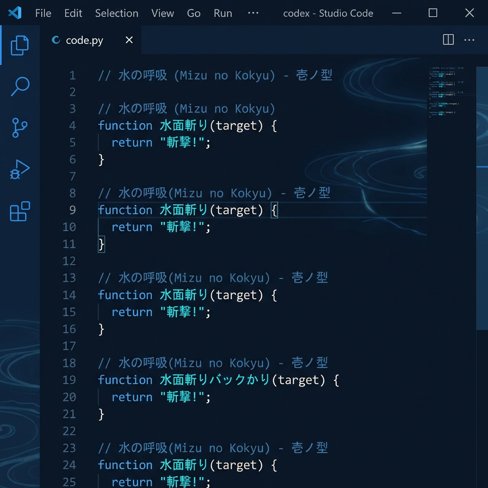

# ⚔️ Demon Slayer Breathing Themes

A collection of VS Code themes inspired by the breathing techniques from Demon Slayer, featuring vibrant anime-style colors and immersive coding experiences.



## 🌊 Available Breathing Styles

### Water Breathing (呼吸 Mizu no kokyū)

Inspired by Tanjiro's flowing water techniques

- **Colors**: Deep blues, cyan, aqua
- **Style**: Calm, flowing, elegant
- **Best for**: Long coding sessions, peaceful focus

### 🔥 Flame Breathing (炎の呼吸 Honō no kokyū)

Inspired by Rengoku's fierce flame techniques

- **Colors**: Fiery oranges, reds, yellows
- **Style**: Intense, energetic, powerful
- **Best for**: High-energy coding, passion projects

### ⚡ Thunder Breathing (雷の呼吸 Kaminari no kokyū)

Inspired by Zenitsu's lightning-fast techniques

- **Colors**: Electric yellows, gold, purple accents
- **Style**: Fast, sharp, striking
- **Best for**: Quick tasks, debugging sessions

### 🦋 Insect Breathing (蟲の呼吸 Mushi no kokyū)

Inspired by Shinobu's elegant poison techniques

- **Colors**: Purples, pinks, soft magentas
- **Style**: Elegant, graceful, precise
- **Best for**: Detailed work, UI/UX development

## 📦 Installation

1. Open VS Code
2. Press `Ctrl+Shift+P` (Windows/Linux) or `Cmd+Shift+P` (Mac)
3. Type "Color Theme" and select "Preferences: Color Theme"
4. Choose your breathing style!

Or install from marketplace:

```
ext install fidelp27.demon-slayer-themes
```

## ✨ Features

- 🎨 **4 Unique Themes** - Each with distinct color palettes
- 🌈 **Anime-Inspired** - Vibrant colors true to the series
- 💻 **Complete Coverage** - UI, syntax, terminal all themed
- 🔥 **Semantic Highlighting** - Enhanced code understanding
- 🎯 **Optimized Contrast** - Easy on the eyes

## 🎬 Future Effects

Planning to add an extension with:

- 💧 Water particle effects when typing
- 🔥 Flame trails on save
- ⚡ Lightning flashes on successful builds
- 🦋 Butterfly animations on file open
- 🔊 Breathing technique sound effects

## 🖼️ Screenshots

_Coming soon: Screenshots of each breathing style in action_

## ⚔️ Breathing Technique Comparison

| Breathing  | Primary Color | Energy  | Best For         |
| ---------- | ------------- | ------- | ---------------- |
| Water 🌊   | Blue          | Calm    | Focus work       |
| Flame 🔥   | Orange        | High    | Passion projects |
| Thunder ⚡ | Yellow        | Sharp   | Quick tasks      |
| Insect 🦋  | Purple        | Elegant | UI work          |

## 📝 License

MIT License - Feel free to use and modify!

## 🐛 Issues & Suggestions

Found a bug or want a new breathing style? Open an issue!

---

**Set your breathing and start coding!** ⚔️🌊🔥⚡🦋
